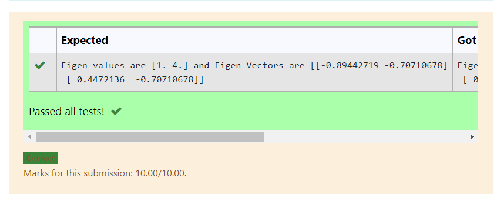

# EIGENVALUES-AND-EIGENVECTORS
## Aim:
To write a python program to find the Eigenvalues and Eigen Vectors
## Equipment’s required:
1. 	Hardware – PCs
2. 	Anaconda – Python 3.7 Installation / Moodle-Code Runner
## Algorithm:
### Step1 : 
To find the eigen value and vector using python programming.
### Step 2: 
Import numpy as np.
### Step 3: Using the np.linalg.eig(),  we get two results (first is eigenvalue and second is eigenvector) of the given matrix.
### Step 4: 
Print the result.

## Program:
```
#Program to find the eigen values and eigen vectors.
#Developed by: Virgil Jovita A
#RegisterNumber:21500600
import numpy as np
A = np.array([[2,2],[1,3]])
value,vector = np.linalg.eig(A)
print("Eigen values are {} and Eigen Vectors are {}" .format(value,vector))
```
## Output:

## Result:
Thus the Eigenvalue and Eigenvector is successfully solved using python program
